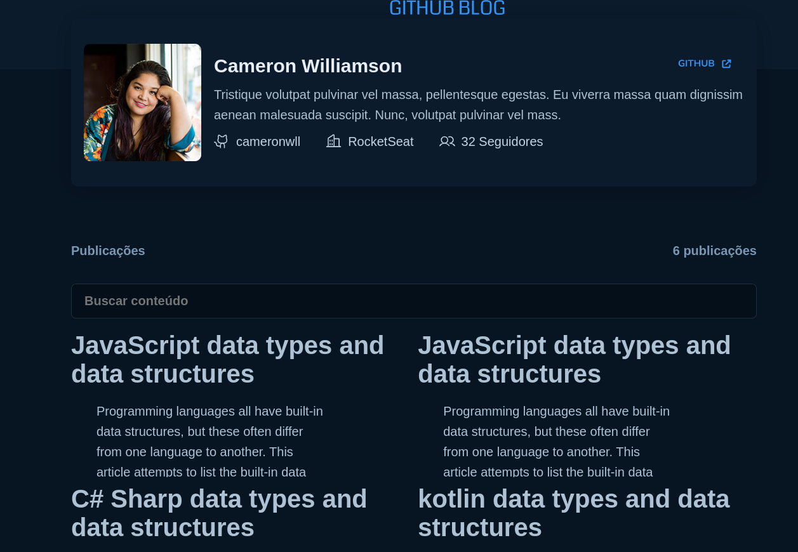
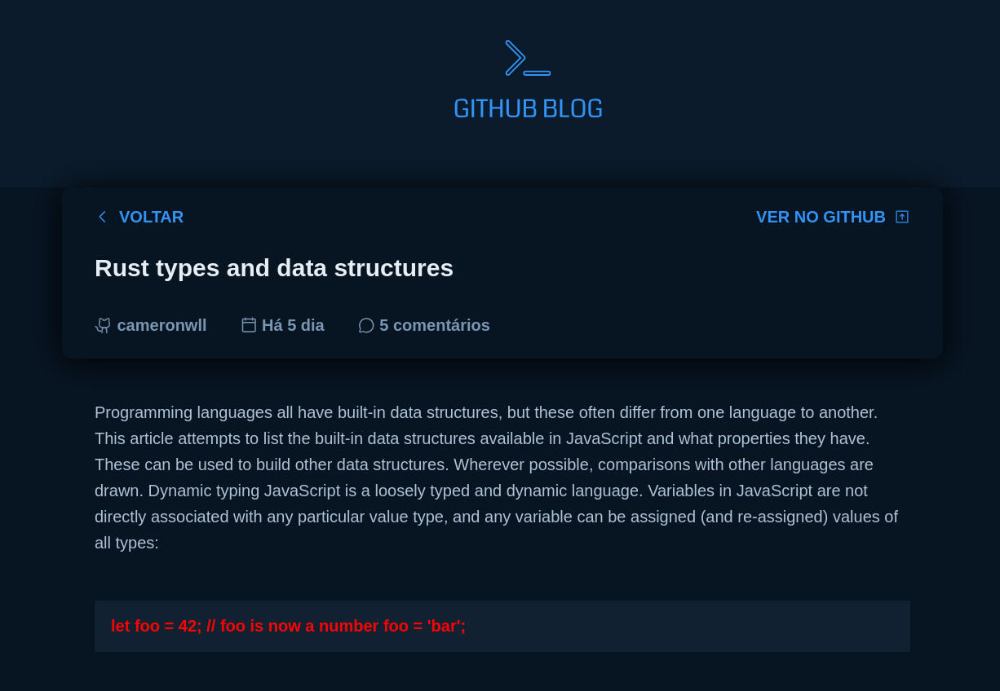

### Projeto Github Blog

### Desafios:

- Selecionar artigos pela busca.
- Ao clickar no artigo ser direcionado para leitura completa do artigo.
- Utilizei o NavLink para navegar entre as páginas.
- Utilziei o useParams() do React Router Dom para selecionar o id do artigo.
- Para que o mesmo artigo seleiconado seja o mesmo da leitura que deseja fazer.

### Ferramentas utilizadas.

- ReactJS
- Styled Components
- React-Router-Dom
- ViteJS

### OBS 

## EM BREVE IREI ATUALIZAR 

- API REAL DO GITHUB
- UTILZIAR A FERRAMENTA REACT-HOOK-FORM

### Imagens do projeto

